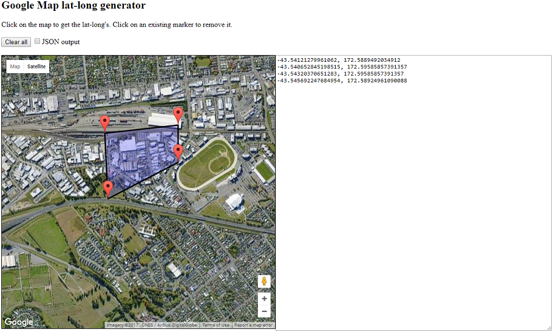

  Utility to generate points for a geofence.
  Cobbled from:
  http://gmaps-samples-v3.googlecode.com/svn/trunk/poly/poly_edit.html
  and
  https://gist.github.com/cintimedia/896595
  
  NOTE: If unable to see the map, then you'll need to get a new key from https://developers.google.com/maps/documentation/javascript/get-api-key
***********************************************************************

